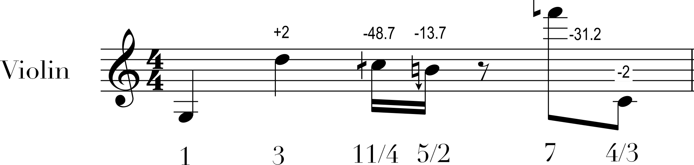
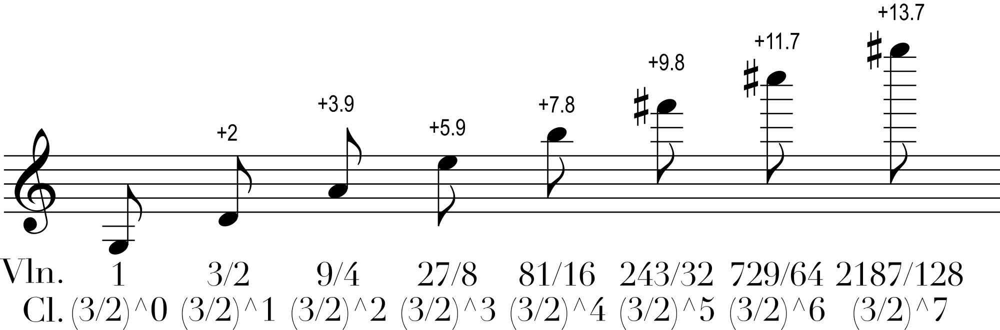
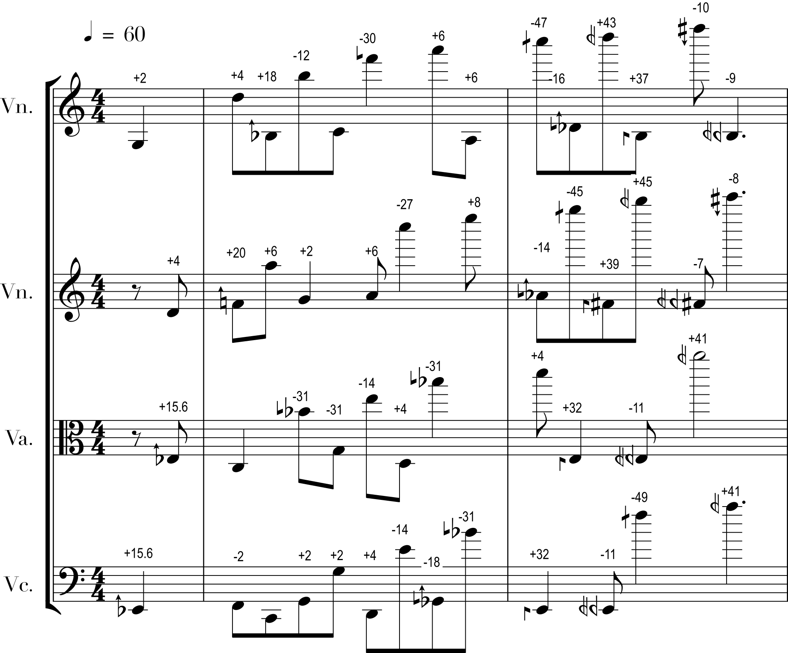

<h2> Figure 1 </h2>



<h2> Figure 2 </h2>



Listening to only the violin part:



Listening to only the clarinet part:



<h2> Figure 3 </h2>



<h2> Figure 4 </h2>

(Sounds the same as figure 3)



<h2> Figure 5 </h2>



<h2> Figure 6 </h2>



